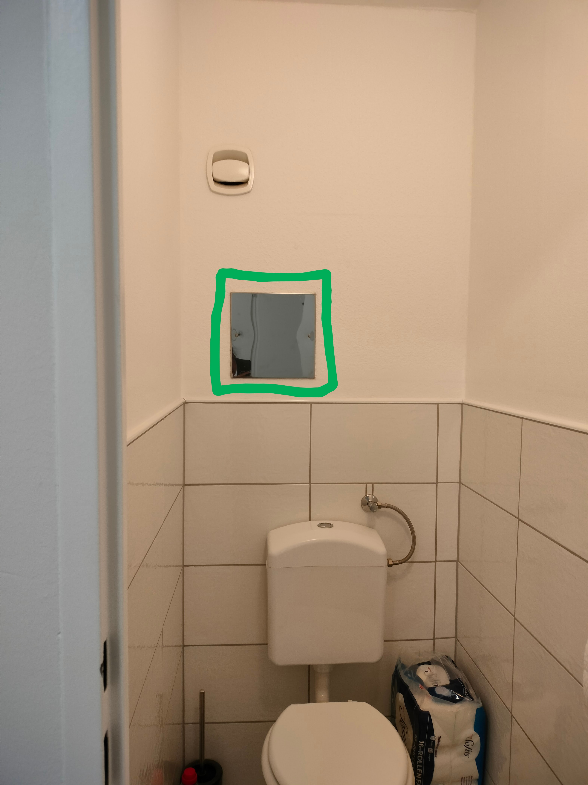
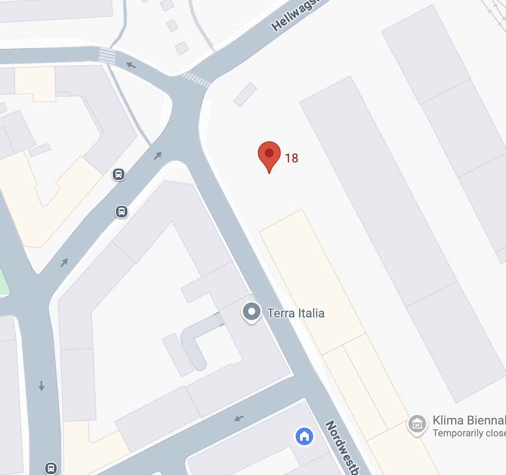
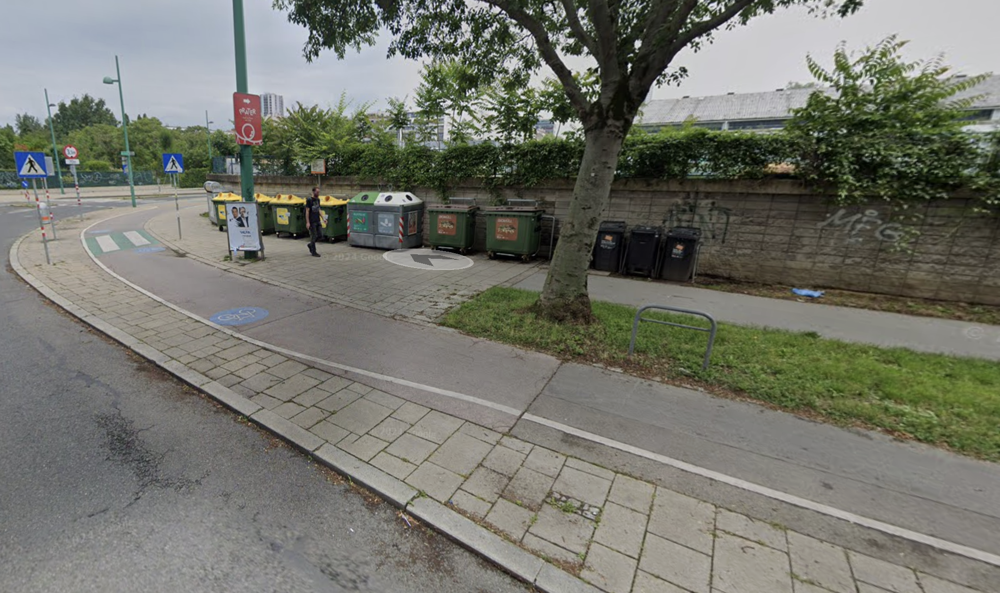

# Arjun's Guide to Vasudha's apartment in Vienna

Address: Nordwestbahnstrasse 91/6, 1200, Vienna ([Google maps](https://maps.app.goo.gl/WoooYEioZm2LC27R8))

## Keys
- The big metal key is for the apartment building door, apartment door and the waste-room and cycle storage room 
- The small metal key is for the post box (it would be great if you could bring up the post sometime)
- The small key with black handle is for the bicycle lock 
- When you're leaving, you can lock up and leave them in the post box, and I can pick it up later in the day

## Turning on water supply 
As soon as you enter the apartment, the door facing you on the right-hand side is the toilet. Facing you there is a metal plate held by two screws, behind which are the taps for the cold and hot water for the apartment. I had to turn them off because I was leaving for a long time, but you can turn them back on by turning the taps anti-clockwise. Water should start running instantly. Call me if there's any issue!
<table style="border-collapse: collapse; border: none;">
  <tr>
    <td style="border: none;"></td>
    <td style="border: none;"></td>
  </tr>
</table>

## Wifi and appliances
- The white modem next to the table in the living room is the wifi. Plug it in and it should be ready in a couple of minutes. 
  - **Network name: A1_0A65**
  - **Password: 2A47524224**
- Also plug in other appliances: microwave, kettle, washing machine (the refrigerator and electric stove and oven should already be running).
- The bed and sofa are covered with sheets - it would be great if you could wash them (the drying rack is behind the living room door).

## Groceries in the kitchen
- Shelf stable things: rice, toor dal, canned chickpeas and tomatoes, pasta, Barilla tomato sauce, muesli, shelf-stable milk, semolina, vermicelli and some other things. In addition to this - a lot of spices, and sauces in the fridge 
- Frozen food: green chillies, some frozen parathas, curry leaves, and some vegetables 
- Based on how much you want to cook, get fresh stuff (vegetables, fruits, yoghurt and milk) when you arrive, from the airport or the [Billa at Praterstern](https://maps.app.goo.gl/j1g4BHKqQbXNzt7o7) station, which is open on Sundays 
- Note: Some pots and pans have non-stick lining, so please use wooden utensils while cooking with them.

## Cleaning supplies 
Sorry there's no vaccum cleaner - I wanted to buy it before you came, but I didn't have the time. There's a broom and mop next to the washing machine and some other cleaning supplies are under the kitchen sink (if you want to wipe dust off of surfaces).

## Using the shelf-toilet 
A unique feature of my apartment is the shelf-toilet which has its advantages and disadvantages (read more [here](https://medium.com/banterist/poland-dispatch-the-german-poo-shelf-toilet-56e142b42c57) and [here](https://amsenneff.wordpress.com/2010/09/18/heres-a-culture-lesson-for-you-the-pooh-shelf/)). But some brief pointers for using the shelf toilet (after months of experience) - 
  - Lay down a layer of toilet paper on the shelf beforehand to ease cleanup.
  - A double flush is useful — once right after use, and once more after discarding the paper.
  - Use the toilet brush if any traces remain. 

## Waste and Recycling  

General or mixed waste goes in the big dustbin in the kitchen and gets thrown in the "Restmull" (general waste) black bins in the building "Mullraum" (waste room) - the room on the left side when you enter the building (image on the right)

If you feel inclined to recycle, this is the system in Vienna - 
1. **Cardboard and paper** - Flatten everything and put them in the "Altpapier" bins the building waste room
2. **Bio waste** - Put the biodegradable waste in the small bin in the kitchen with the green biodegradable plastic bags and take it to the recycling point down the street. The green plastic gets soggy and leaks, so take out the bio waste 2-3 days depending on how much you use it 
3. **Glass** - Green and brown glass gets recycled at the recycling point down the street. If you use pasta jars or other small glass containers, feel free to wash them and leave them in the kitchen 
4. **Plastic and packaging** - this includes metal cans, aluminium, mixed cardboard and plastic packing (including milk and yoghurt packets sometimes). Check for the recycling symbol if you're unsure. If they had food in them, you can rinse them and put them in the white Spar bag next to the dustbin in the kitchen and once its full, take all the recycling together to the recycling point - in the yellow bins labelled "Verpackung"
   
The recycling point is ~100 m from the apartment and indicated in the map ([link](https://maps.app.goo.gl/5qcRnpqWKfwqu3PE6)) below
<table style="border-collapse: collapse; border: none;">
  <tr>
    <td style="border: none;"></td>
    <td style="border: none;"></td>
  </tr>
</table>

## Grocery stores nearby 
- [BILLA](https://maps.app.goo.gl/e4TnZu9cvEFGNTS6A) on Dresdner Strasse - Slightly expensive grocery store, but you'll find everything there 
- [Melita Turkish store](https://maps.app.goo.gl/RgX8AjNxrh5khU6AA) - I like buying fruits and vegetables and Turkish köy yoghurt (which tastes closer to curd than Greek or other European yoghurt)
- [Lidl](https://maps.app.goo.gl/1xVqVkXYLNnySM4LA) on Wallensteinstrasse - Slightly far but also slightly cheaper alternative to Billa on  

## Cycle storage 
Feel free to use the cycle! I kept it in the apartment, but if you're using it regularly, feel free to keep it in the "Kinderwagenraum" (Stroller room) in the building (image on the right). It's quite cramped and you might have to move around some things to make the cycle fit. Small heads up: The owners of my apartment said I could keep my cycle there, but some old Austrian residents of the building said I shouldn't use it for cycle, but I think it's fine. Pretend you don't understand them xD 

## Public transport 
- Nearest stations: U-bahn U6 - Dresdnerstrasse, Tram 5 - Raucherstrasse, Bus 5A - Brigittagasse
- Summer construction in Vienna: Some lines are not running (importantly: U4 between Friedensbrucke and Schwedenplatz)
- To TU Wien: Bus 5A from Brigittagasse to Nestroyplatz; then U1 from Nestroyplatz to Karlsplatz 
- To Airport: Tram 5 to Praterstern and then S-bahn to airport (don't take city-airport train - it's not worth 16 euros)

 